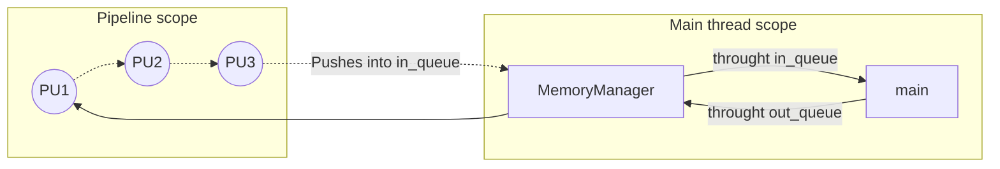

# (Unified Computer Image and Data-Processing)

# AUTHOR

**Name:** Lucas Hernández Abreu

**email:** lucas.hernandez.09@ull.edu.es

# LICENSE

LUCID (Unified Computing Image and Data-Processing) is a program to process
any type of data concurrently.
Copyright (C) 2023 Lucas Hernández Abreu

This program is free software: you can redistribute it and/or modify
it under the terms of the GNU General Public License as published by
the Free Software Foundation, either version 3 of the License, or
(at your option) any later version.

This program is distributed in the hope that it will be useful,
but WITHOUT ANY WARRANTY; without even the implied warranty of
MERCHANTABILITY or FITNESS FOR A PARTICULAR PURPOSE. See the
GNU General Public License for more details.

You should have received a copy of the GNU General Public License
along with this program. If not, see <https://www.gnu.org/licenses/>.

Author: Lucas Hernández Abreu

Contact: lucas.hernandez.09@ull.edu.es

# INTRODUCTION

LUCID (Unified Computing Image and Data-Processing) is a framework for
processing data concurrently via the development of processing units. Each
processing unit can have multiple instances that will run in parallel.

The following diagram illustrates its work:



# Usage

First of all, we need some dependencies for LUCID to work:

```bash
Make
Cmake
gtest
```

Then you can clone this repository and

Once you have cloned this repository you have to make sure there is a `build`
directory in it.

If there is no `build` directory execute the following command in the same
level as the `src` directory:

```bash
mkdir build
```

Now to build the program go into the build directory with `cd build` and
execute the following command:

```bash
cmake ..
```

After you have built it you can find the executable at the `bin` directory.

Now run the executable in one of this three modes:

```bash
LUCID (Unified Computing Image and Data-Processing)
        Copyright (C) 2023  Lucas Hernández Abreu
        This program comes with ABSOLUTELY NO WARRANTY

Execute inside bin with:
    ./lucid run <arg>
Valid args:
        Debug -> [debug]|[-d]|[--debug]: Shows the debug information:
            (operations in MemoryManager, semaphore statuses...)
        Debug Processing Units -> [pudebug][--pd][--pu-debug]: shows the debug for the processing units
            (operations inside the processing units)
        Help -> [help]|[-h]|[--help]: Shows this message
        Profiling -> [profiling]: Shows the profiling information
```

# Configuration

For this framework you can add any number of processing units, make sure your
units implementation look like this:

```c++

#include "processing_unit_interface.h"
class NewUnit : public ProcessingUnitInterface {
    NewUnit();
    ~NewUnit();

    // This function will always run: use it to instanciate unit variables.
    void Start() override;

    // This function will always run: use it to get the data from the pipe and
    // proccess it
    bool Run(void*) override;

    // This method is a placeholder for possible deletion in the unit
    void Delete() override;

    // Make sure to return a pointer to your new processing unit
    ProcessingUnitInterface* Clone() override;
};

```

You have examples into the `include/headers/pu/` and `include/definitions/pu/` directories.

For the program to work use the following list of steps in the main file:

1. Instantiate the processing units to use.
2. Create a new MemoryManager object
3. Use the `LoadMemoryManager(void*)` function to allocate the size for all
   the cells in the memory manager.
4. Create a pointer to a `Pipeline` and instantiate it with the first
   processing unit you want to use.
5. Add all the processing units you want to use for your process.
6. Run the pipe.
7. Iterate throught the data in the MemoryManager object: poping from In and
   pushing into out to start the process.
8. Wait for the pipe to finish with the `WaitFinish()` function.
